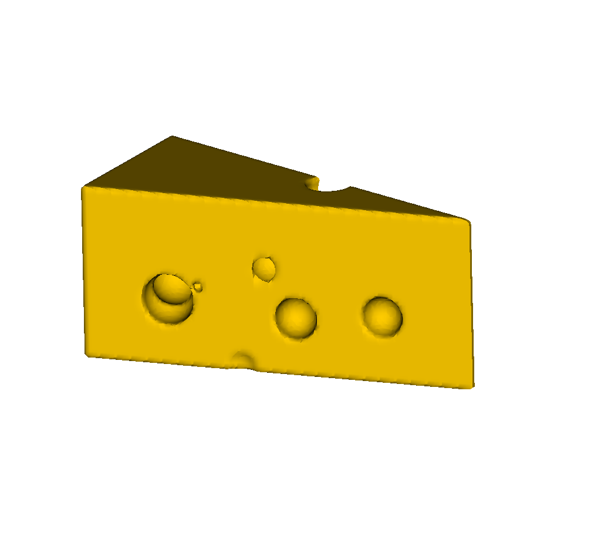

sdf_tools
=========

A simple tool to create complex geometries from simple shapes, with python bindings.

.. toctree::
   :maxdepth: 2
   :caption: User guide

   user/installation
   user/tutorials
   user/grid
   user/sdf

.. literalinclude:: ../../tests/tuto/cheese.py
   :name: cheese-py
   :caption: `cheese.py`

    0-isosurface of the SDF obtained from :ref:`cheese-py`.
