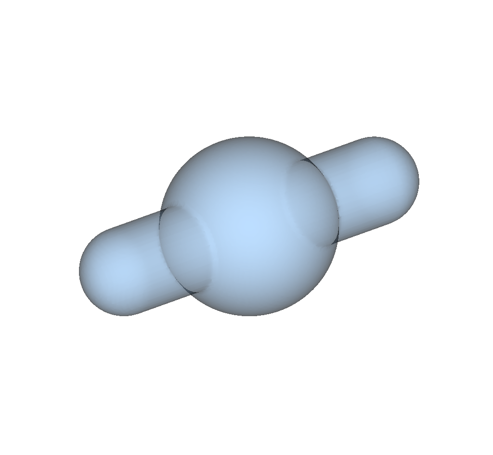
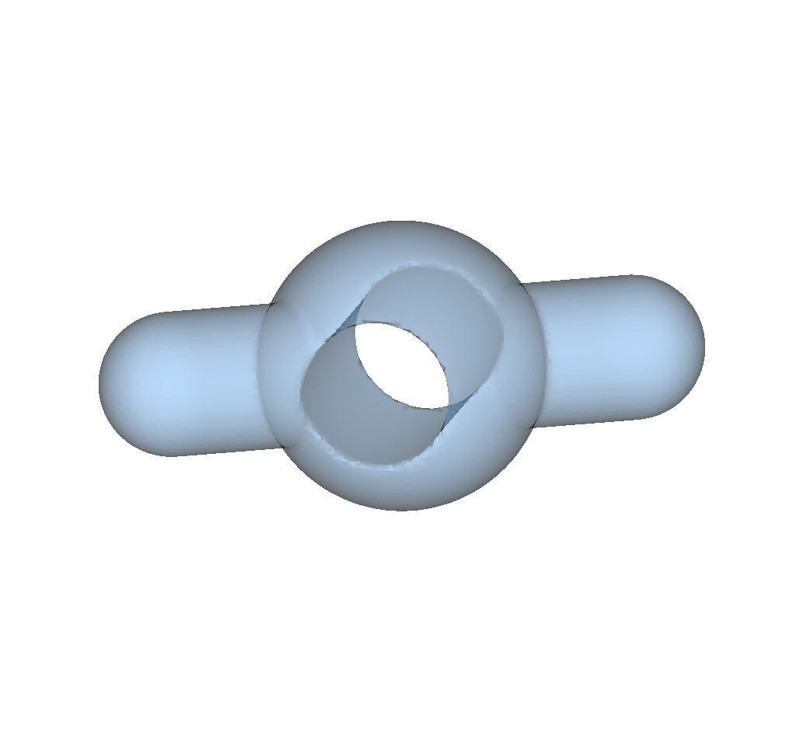

.. _user-tutorials:

.. role:: console(code)
   :language: console

Examples
########

Here we show a few simple examples on how to use ``sdf_tools``.

A Sphere...
***********

Create the SDF of a single sphere in the middle of a domain:

.. literalinclude:: ../../../tutorial/01_sphere.py
   :name: sphere-py
   :caption: `sphere.py`

The above script can be run by typing

.. code-block:: bash

    python 01_sphere.py

The resulting files ``sphere.bov`` and ``sphere.values`` can be visualiszed with
`visit <https://wci.llnl.gov/simulation/computer-codes/visit>`_.

.. figure:: ../images/sphere.png
    :figclass: align-center
    :width: 90%

    Isosurfaces of the sphere SDF obtained from :ref:`sphere-py`.

Binary operations
*****************

It is possible to apply operations between several shapes.
Let us create the union of a ball and a capsule (see :any:`Capsule`).

.. literalinclude:: ../../../tutorial/02_union.py
   :name: union-py
   :caption: `02_union.py`

    0 - Isosurface of the SDF obtained from :ref:`union-py`.

More complex geometries
***********************

It is very easy to extend the previous example to create more complex geometries.
An example is shown here:

.. literalinclude:: ../../../tutorial/03_complex.py
   :name: complex-py
   :caption: `03_complex.py`

    0 - Isosurface of the SDF obtained from :ref:`complex-py`.
