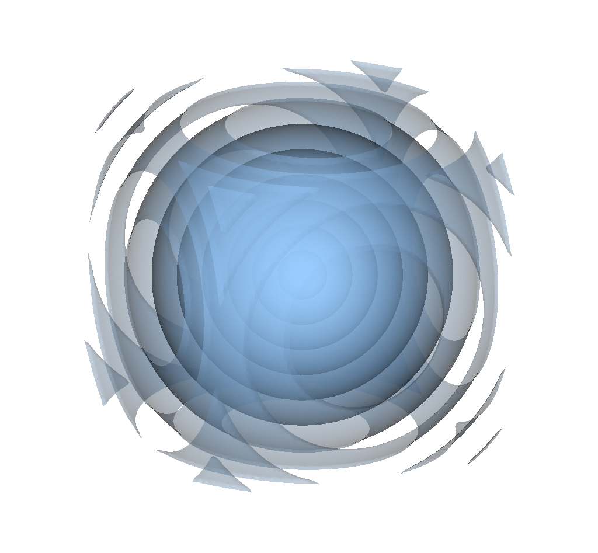

.. _user-tutorials:

.. role:: console(code)
   :language: console

Examples
########

Here we show a few simple examples on how to use ``sdfTools``.

A Sphere...
***********

Create the SDF of a single sphere in the middle of a domain:

.. literalinclude:: ../../../tests/tuto/sphere.py
   :name: sphere-py
   :caption: `sphere.py`

The above script can be run by typing

.. code-block:: bash

    python3 sphere.py

The resulting files ``sphere.bov`` and ``sphere.values`` can be visualiszed with
`visit <https://wci.llnl.gov/simulation/computer-codes/visit>`_.

    Isosurfaces of the sphere SDF obtained from :ref:`sphere-py`.

Binary operations
*****************

It is possible to apply operations between several shapes.
Let us create the union of a ball and a capsule (see :any:`Segment`).

.. literalinclude:: ../../../tests/tuto/union.py
   :name: union-py
   :caption: `union.py`

    0 - Isosurface of the SDF obtained from :ref:`union-py`.

More complex geometries
***********************

It is very easy to extend the previous example to create more complex geometries.
An example is shown here:

.. literalinclude:: ../../../tests/tuto/three.py
   :name: three-py
   :caption: `three.py`

    0 - Isosurface of the SDF obtained from :ref:`three-py`.

Edges and extrusion
*******************

It is also possible to create SDF in 2 dimensions from arbutrary polygons.
This can be also extruded to get a prism in 3 dimensions:

.. literalinclude:: ../../../tests/tuto/prism.py
   :name: prism-py
   :caption: `prism.py`

.. figure:: ../images/prism.png
    :figclass: align-center
    :width: 90%

    0 - Isosurface of the SDF obtained from :ref:`prism-py`.
